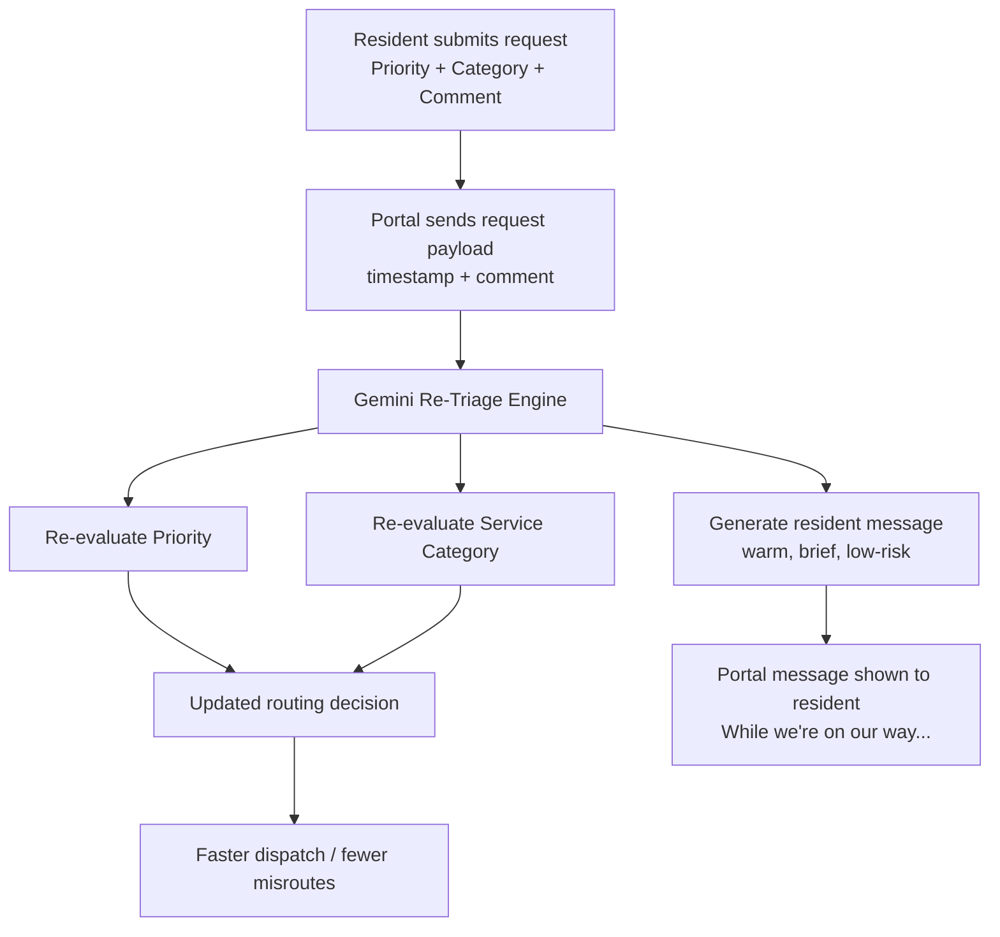

# AI Maintenance Ticket Assistant (Gemini)
### __*An LLM-powered triage layer for real-time request classification and resident guidance. [(click here for demo)](https://ai-maintenance-ticket-assistant.streamlit.app)*__
## What this project does

Residents submit maintenance requests through a portal and choose a **priority** and **service category**.  
In practice, those choices are often wrong:

- an emergency issue may be submitted as routine
- the wrong category sends the ticket to the wrong team
- residents get no communication while waiting

This project adds an **AI triage layer** that re-evaluates the request in real time and returns:

- **AI Priority** (restricted to official portal labels: routine, urgent, emergency)
- **AI Service Category** (restricted to official category list)
- **Resident-facing guidance** (“While we’re on our way...”) — warm, short, safety-focused, and low-risk

## Example
- Resident Label: 03-Routine | Category: Storm Damage
- Resident Comment: "The downed trees on boxwood are a safety concern for the kids walking to the bus... children are walking under the trees branches that were broken from the snow. If this can be cleaned up asap."
- AI Re-Triage: 02-Urgent | Category: Grounds and Landscaping
- AI Message: _"We understand your concern; please advise children to avoid the area until it is safely cleared."_

## Key Features
- **Semantic Re-Classification:** Moves beyond keyword matching to understand the intent and severity of the resident's text.

- **Constrained Output (Enum Enforcement):** Uses structured output to ensure the AI only returns valid, system-recognized categories and priorities.

- **Safety-First Resident Guidance:** Generates short, empathetic "While we're on our way" instructions that prioritize resident safety without offering risky DIY advice.

- **Real-Time Middleware:** Designed to sit between the Resident Portal and the Dispatch Database to correct data before it is routed.

## Architecture

## Business Impact

This solves two operational problems at once:

1. **Better routing / faster response**
   - catches likely miscategorized requests before dispatch
   - reduces delays caused by wrong team assignment
   - reduces manual re-triage costs and MTTR (Mean Time to Resolution)

2. **Better resident experience**
   - immediate, reassuring message after submission
   - maintain a professional, calm, and helpful tone for resident-facing messages