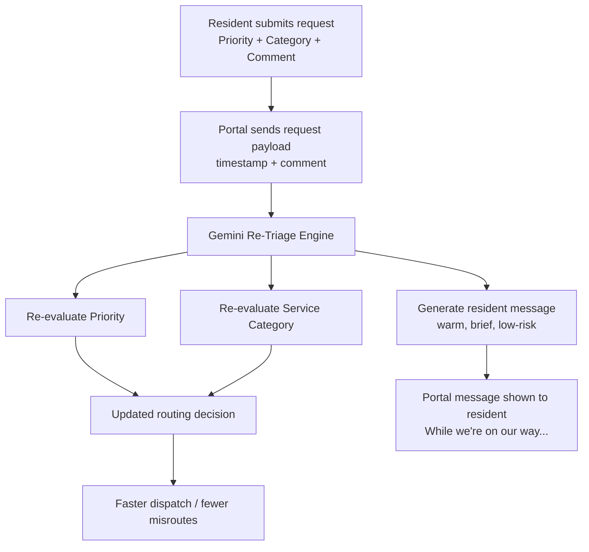

# AI Service Request Re-Triage Assistant (Gemini)

## What this project does

Residents submit maintenance requests through a portal and choose a **priority** and **service category**.  
In practice, those choices are often wrong:

- a dangerous issue may be submitted as **Routine**
- the wrong category sends the ticket to the wrong team
- residents get no immediate guidance while waiting

This project adds an **AI triage layer** that re-evaluates the request in real time and returns:

- **AI Priority** (restricted to official portal labels)
- **AI Service Category** (restricted to official category list)
- **Resident-facing guidance** (“While we’re on our way...”) — warm, short, safety-focused, and low-risk

## 10-second architecture

## Why this matters

This solves two operational problems at once:

1. **Better routing / faster response**
   - catches likely miscategorized requests before dispatch
   - reduces delays caused by wrong team assignment

2. **Better resident experience**
   - immediate, reassuring message after submission
   - safe communication (no DIY repair instructions)

## Demo Portal UI

The Streamlit app simulates a service request portal for demo.